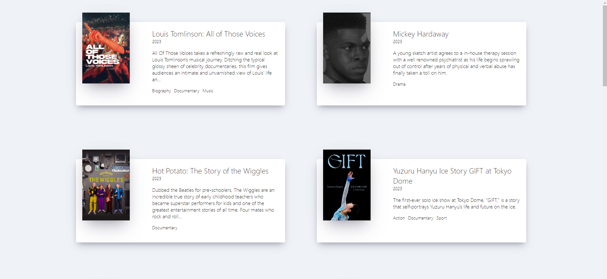

# 노마드 코더 강의(영화 리스트)

## 서비스 소개

- 영화 리스트

## Skill Set


## 실행

```
npm build
npm run start
```

## Front-end Developer

- 배정태

## 프로젝트 설명 
해당 프로젝트는 노마드코더 강의를 보고 만들어졌습니다.
영화 리스트를  데이터를 받은 후 화면에 출력하는 방식으로 제작 되었습니다

## 강의 페이지

